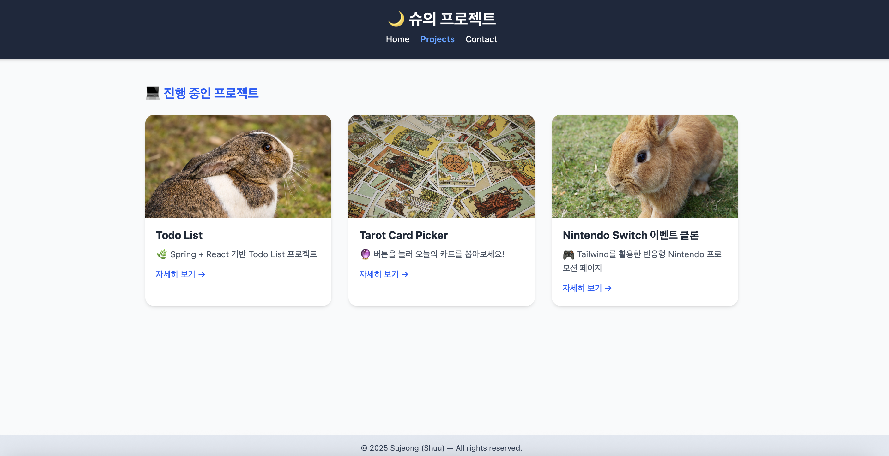

<!-- 대표 썸네일 -->
<p align="center">
  
</p>

# 🌙 Intro – Sujeong’s Frontend Playground

> **TailwindCSS × JavaScript × UI 실습 저장소**  
> 디자인 감각과 프론트엔드 구조 이해를 함께 키워가는 공간입니다.  
> “하루에 하나씩 배우며 성장하는 프론트엔드 여정 🌿”

---

## ✨ 프로젝트 개요

| 항목 | 내용 |
|------|------|
| 💡 프로젝트명 | **Intro – Sujeong’s Frontend Playground** |
| 🧱 기술 스택 | HTML · CSS · **TailwindCSS (v4)** · JavaScript |
| 🎨 주요 기능 | 반응형 카드 그리드, 타로 카드 인터랙션, 3D 애니메이션 |
| 🔧 빌드 환경 | NPM + Tailwind CLI |
| 📦 배포 | GitHub Pages |
| 🧑‍💻 제작자 | [**Sujeong (Shuu)**](https://github.com/Shuu620) |

---

## 🚀 Live Demo

> 🔗 **[🌙 바로가기 – GitHub Pages에서 보기](https://shuu620.github.io/intro/)**  
> *(현재 브랜치 main 기준, 자동 업데이트)*


---

## 🗂️ 프로젝트 구조

intro/
├─ index.html
├─ projects.html
├─ src/
│ └─ index.css
├─ dist/
│ └─ output.css
└─ img/
└─ tarot/
├─ back.png
├─ the-fool.png
├─ the-magician.png
└─ ... the-world.png

---

## 🧠 핵심 기능 소개

### 🪄 1️⃣ Tarot Card Picker (오늘의 타로)
> “버튼을 눌러 오늘의 운세 카드를 한 장 뽑아보세요 🔮”

```js
const TAROT = [
  { key: "the-fool", name: "0. The Fool (광대)", meaning: "새로운 시작, 자유, 가능성" },
  { key: "the-magician", name: "I. The Magician (마법사)", meaning: "의지, 실행력, 자원 활용" },
  ...
];

// 하루 한 번만 뽑기
const today = new Date().toDateString();

if (localStorage.getItem("tarot") === today) {
  alert("오늘은 이미 카드를 뽑았어요 🌙");
} else {
  pickTarot();
  localStorage.setItem("tarot", today);
}
```


### 🧩 2️⃣ Projects Page (반응형 카드 그리드)
기능	설명
- 💻 카드형 UI	Tailwind grid-cols-1 sm:grid-cols-2 lg:grid-cols-3
- 🪶 그림자 효과	shadow-md hover:shadow-lg transition-shadow
- 📱 반응형 디자인	모바일 → PC 자동 재배치
- 🎨 Hover Interaction	카드에 마우스를 올리면 부드러운 확대 효과


🧰 기술 스택
| 영역 | 사용 기술 | 설명 |
| :--- | :--- | :--- |
| **Frontend** | HTML5, TailwindCSS, JavaScript | 반응형 구조, 인터랙션 구현 |
| **Styling** | TailwindCSS v4 (NPM + CLI) | 유틸리티 클래스 기반 디자인 |
| **Version Control** | Git, GitHub | 커밋 히스토리 관리 및 배포 |
| **Build Tool** | Tailwind CLI | `npx tailwindcss --watch` 로 실시간 빌드 |

⚙️ Tailwind 빌드 환경 (v4)
설치
```js
npm init -y
npm install -D tailwindcss
npx tailwindcss init

src/index.css
@import "tailwindcss";

/* 커스텀 스타일은 아래에 추가 */
빌드 실행
npx tailwindcss -i ./src/index.css -o ./dist/output.css --watch
```

## 🧪 Day-by-Day Highlights
### Day	주요 내용
- Day 1	Tailwind CDN으로 소개 페이지 제작
- Day 2	Projects 페이지 반응형 카드 레이아웃 + Tarot Picker 기본 버전
- Day 3	Tarot 3D Flip / Fade-in / 하루 1회 제한 추가 + README 정리

### 💬 Commit Convention (예시)
- Type	설명
- feat:	새로운 기능 추가
- fix:	버그 수정
- style:	디자인 및 스타일 조정
- docs:	문서 (README 등) 수정

```js
예시:
feat: Tarot 하루 1회 제한 기능 추가
style: 카드 hover 그림자 효과 수정
docs: README 포트폴리오 버전 업데이트
```

### 🌈 Screenshots

	
### 🧭 향후 계획
 - 🎨 “오늘의 컬러 팔레트” 생성기 추가
 - 📆 “나의 하루 기록” 기능 (localStorage 기반)
 - 💡 Tailwind + React로 리팩토링
 - 🌐 Netlify 자동 배포 연동

### 📬 Contact
- 💌 Author: Sujeong (Shuu)
- 🏠 GitHub: https://github.com/Shuu620
- 🌐 Portfolio: https://shuu620.github.io/intro/

### 📝 License
- 본 프로젝트는 개인 학습 및 포트폴리오 목적으로 제작되었습니다.₩n
- 필요시 MIT License로 자유롭게 수정 및 재사용 가능합니다.
